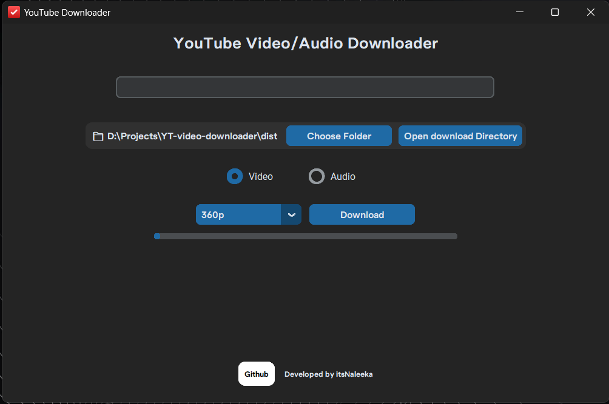
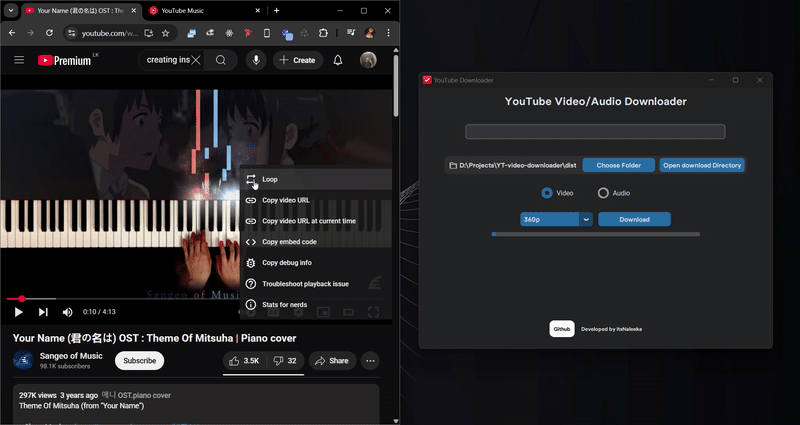
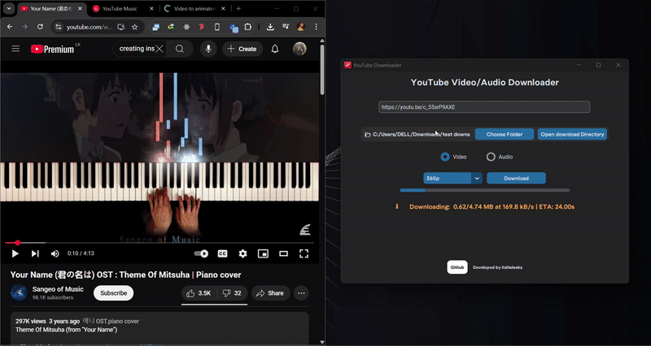

# 🎬 YouTube Downloader (Beginner-Friendly Python Project)

This is a simple and beginner-friendly YouTube video/audio downloader built using **Python**, **yt-dlp**, and **CustomTkinter**. It features a clean graphical user interface that allows users to download YouTube videos in different qualities or extract audio in various bitrates.

📦 A setup file is provided that installs the app to `C:\Program Files\YouTube Downloader`.

---

## 🛠️ Features

* Download YouTube videos in 360p, 720p, and 1080p
* Extract audio in 128kbps, 192kbps, 256kbps, and 312kbps
* Custom download folder selection
* Automatic merging of video and audio streams
* Progress bar and status updates
* Splash screen and lightweight interface
* GitHub link and icon integration

---

## 📸 Screenshots

### Main App Interface



## Screen Records


### Downloadig in progress


---

## 🖥️ Prerequisites

> **⚠️ Important:** You must have **FFmpeg** installed and added to your system's **environment variables** for the app to function properly.

### How to install FFmpeg:

1. Download from [https://ffmpeg.org/download.html](https://ffmpeg.org/download.html)
2. Extract the archive
3. Copy the `bin` folder path (e.g., `C:\ffmpeg\bin`)
4. Add it to your **System Environment Variables > Path**

---

## 📥 Installation

1. Download the installer `YouTube_Downloader_Windows_v1.0.1.exe` file from the [Releases](https://github.com/itsNaleeka/YT-video-downloader/releases/tag/Release) section.
2. Run the installer — the app will be installed to:

```
C:\Program Files\YouTube Downloader
```

3. Launch the app from the Start Menu or shortcut.

---

## 💡 About This Project

I'm currently learning Python, and this is one of the beginner-friendly GUI projects I've built along the way. It's a fun project to get hands-on experience with:

* GUI development using `customtkinter`
* Threading
* File handling
* API usage with `yt-dlp`
* Executable packaging with `PyInstaller`
* GUI polish (splash screen, icons, etc.)

---

## 🐙 GitHub Repository

Feel free to explore, fork, or star the project:

👉 [My GitHub](https://github.com/itsNaleeka/YT-video-downloader/)

---
